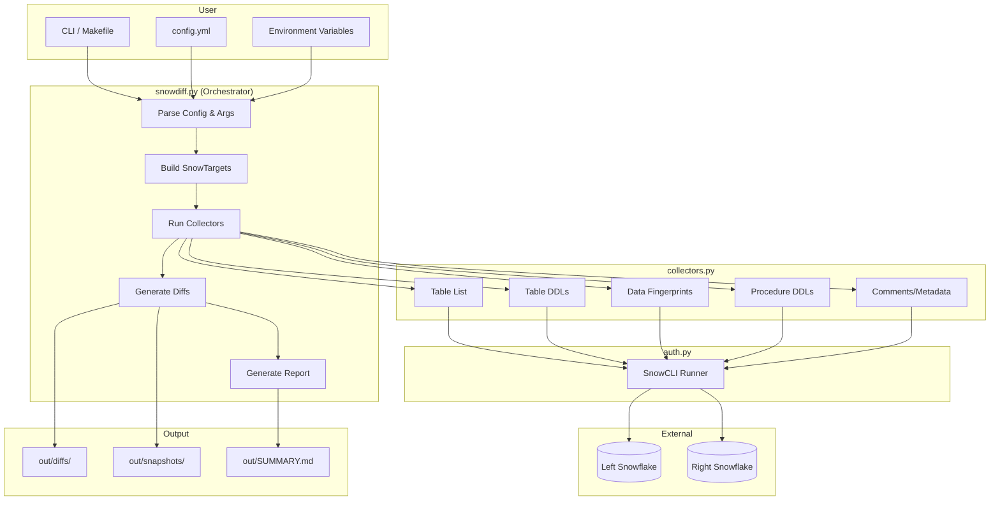
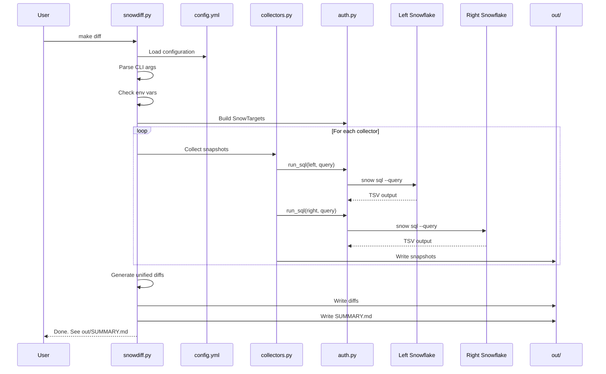
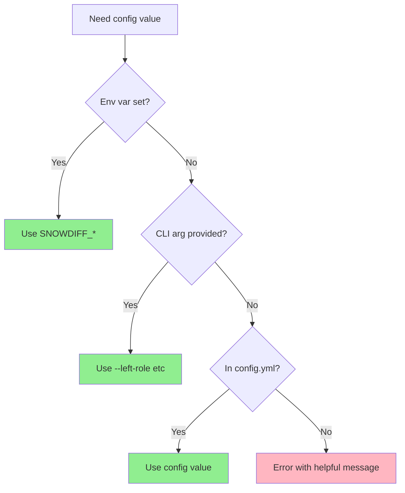
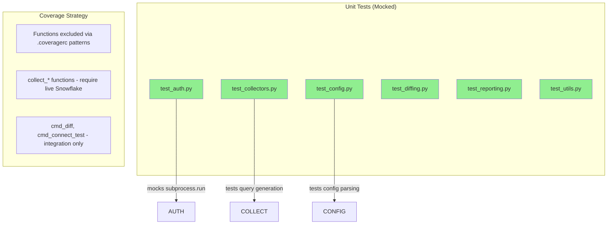

# Architecture

This document describes the architecture of the Snowflake Diff tool.

## Overview

Snowflake Diff is a CLI tool that compares two Snowflake environments (left vs right) using SnowCLI (`snow sql`). It generates unified diffs, a clickable summary, and raw snapshots for audit purposes.

## System Diagram

<details>
<summary>Click to expand system architecture diagram</summary>



</details>

## Data Flow

<details>
<summary>Click to expand data flow diagram</summary>



</details>

## Module Responsibilities

<details>
<summary>Click to expand module details</summary>

### `scripts/snowdiff.py` - CLI Orchestrator

The main entry point that:
- Parses config.yml and CLI arguments
- Reads environment variables
- Builds SnowTarget objects for left/right
- Coordinates collectors
- Generates diffs and reports

### `scripts/auth.py` - SnowCLI Integration

Handles all Snowflake communication:
- `SnowTarget` dataclass with connection details
- `run_sql()` executes queries via `snow sql` with timeout protection
- `ensure_snowcli()` validates SnowCLI is available
- `connection_test()` for connectivity validation

### `scripts/collectors.py` - Snapshot Collection

Contains all query templates and collection logic:
- Table list collection
- DDL extraction (tables and procedures)
- Data fingerprinting (COUNT + HASH_AGG)
- Comment/metadata collection
- Table filtering with pattern matching

### `scripts/diffing.py` - Diff Generation

Pure functions for diff operations:
- `unified_diff()` generates standard unified diffs
- `write_diff_file()` writes diffs only when content differs
- `rel_link()` and `md_anchor()` for Markdown formatting

### `scripts/reporting.py` - Report Generation

Generates the summary report:
- `generate_summary_md()` creates the clickable SUMMARY.md
- Links to individual diff files
- Organizes by section (DDL, data, comments, etc.)

### `scripts/utils.py` - Utilities

Small helper functions:
- `safe_name()` sanitizes filenames for cross-platform compatibility

</details>

## Configuration Priority

<details>
<summary>Click to expand configuration priority diagram</summary>



</details>

## Error Handling

<details>
<summary>Click to expand error handling strategy</summary>

### Graceful Degradation

- **Missing SnowCLI**: `ensure_snowcli()` fails fast with clear message
- **Query errors**: Returns `__ERROR__` sentinel, doesn't crash
- **Timeouts**: Returns `__ERROR__ TIMEOUT` after configurable timeout (default 300s)
- **Missing config**: Error message suggests env var, CLI flag, or config file

### Error Sentinel Pattern

```
__ERROR__<TAB>exit_code<TAB>error_message
```

Example: `__ERROR__\t1\tSQL compilation error: invalid identifier`

This allows:
- Snapshots to be written even with partial failures
- Diffs to show which side had errors
- Reports to indicate issues without crashing

</details>

## Test Architecture

<details>
<summary>Click to expand test architecture</summary>



**Coverage Target**: 80% minimum (actual: 92%)
**Test Count**: 71 tests

</details>
